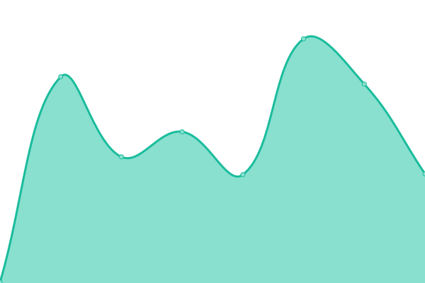
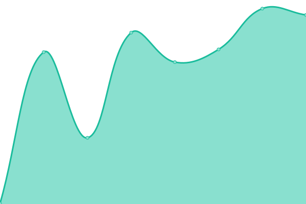
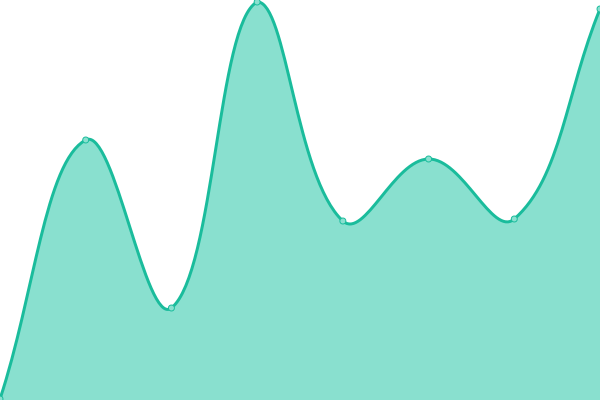

# [📈 Live Status](https://demo.upptime.js.org): <!--live status--> **🟩 All systems operational**

This repository contains the open-source uptime monitor and status page for [Upptime](https://upptime.js.org), powered by [Upptime](https://github.com/upptime/upptime).

With [Upptime](https://upptime.js.org), you can get your own unlimited and free uptime monitor and status page, powered entirely by a GitHub repository. We use [Issues](https://github.com/upptime/upptime/issues) as incident reports, [Actions](https://github.com/kidsontheyard/monitoring/actions) as uptime monitors, and [Pages](https://demo.upptime.js.org) for the status page.

<!--start: status pages-->
<!-- This summary is generated by Upptime (https://github.com/upptime/upptime) -->
<!-- Do not edit this manually, your changes will be overwritten -->
<!-- prettier-ignore -->
| URL | Status | History | Response Time | Uptime |
| --- | ------ | ------- | ------------- | ------ |
|  [Kids on the Yard](https://kidsontheyard.com) | 🟩 Up | [kids-on-the-yard.yml](https://github.com/kidsontheyard/monitoring/commits/HEAD/history/kids-on-the-yard.yml) | 

 293ms
     
 | 

<a href="https://kidsontheyard.com/history/kids-on-the-yard">100.00%</a>
    

|  [Legal Hub](https://legalhub.kidsontheyard.com) | 🟩 Up | [legal-hub.yml](https://github.com/kidsontheyard/monitoring/commits/HEAD/history/legal-hub.yml) | 

 370ms
     
 | 

<a href="https://kidsontheyard.com/history/legal-hub">100.00%</a>
    

|  [ShortURL](https://koty.cc) | 🟩 Up | [short-url.yml](https://github.com/kidsontheyard/monitoring/commits/HEAD/history/short-url.yml) | 

 300ms
     
 | 

<a href="https://kidsontheyard.com/history/short-url">99.82%</a>
    

|  [GeoIP SVC API](https://geoip.svc.koty.app/health) | 🟩 Up | [geo-ip-svc-api.yml](https://github.com/kidsontheyard/monitoring/commits/HEAD/history/geo-ip-svc-api.yml) | 

 956ms
     
 | 

<a href="https://kidsontheyard.com/history/geo-ip-svc-api">98.79%</a>
    

<!--end: status pages-->

[**Visit our status website →**](https://demo.upptime.js.org)
